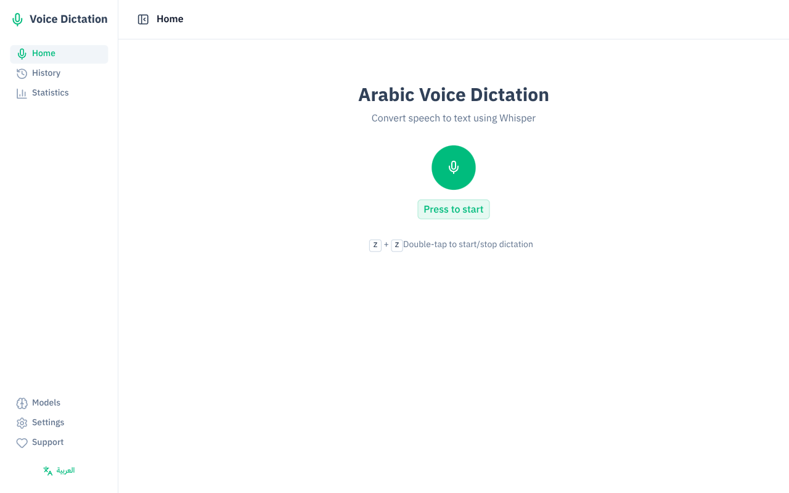
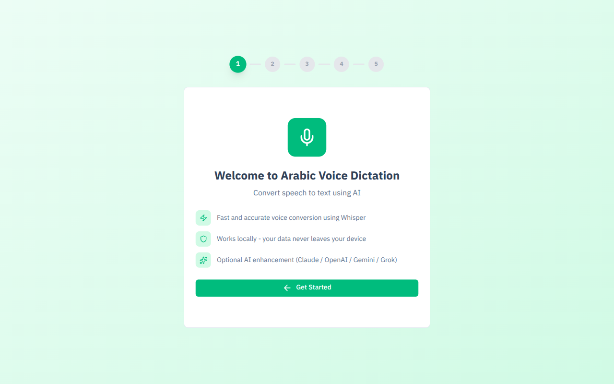

<div align="center">


# كاتِب | Kateb

### Smart Voice Dictation for Arabic & English

**تطبيق إملاء صوتي ذكي يحول كلامك إلى نص مكتوب — يعمل بدون إنترنت**

[](https://github.com/beingmomen/kateb/releases/latest)
[](LICENSE)
[](https://github.com/beingmomen/kateb)
[](https://github.com/sponsors/beingmomen)

[العربية](#العربية) | [English](#english)

</div>

---

## Screenshots | لقطات الشاشة

<div align="center">

| الصفحة الرئيسية — Home | الإعدادات — Settings |
|:---:|:---:|
|  |  |

| الترحيب — Welcome | الدعم — Support |
|:---:|:---:|
|  |  |

</div>

---

## العربية

**كاتِب** هو تطبيق سطح مكتب مفتوح المصدر يحول الكلام إلى نص باللغة العربية والإنجليزية. يعمل محلياً على جهازك بدون الحاجة للإنترنت باستخدام نماذج Whisper من OpenAI، مع خيار تحسين النص بالذكاء الاصطناعي.

### المميزات

- **إملاء صوتي بدون إنترنت** — يعمل محلياً باستخدام Whisper AI
- **يدعم العربية والإنجليزية** — تبديل سهل بين اللغتين
- **تصحيح ذكي بالـ AI** — إصلاح الأخطاء الإملائية والنحوية تلقائياً (اختياري)
- **5 نماذج Whisper** — اختر بين السرعة والدقة حسب جهازك
- **5 مزودي AI** — Claude, OpenAI, Gemini, Grok, أو سيرفر محلي
- **اختصار لوحة مفاتيح** — اضغط `Z Z` مرتين بسرعة لبدء/إيقاف الإملاء
- **عداد تنازلي للسكوت** — إيقاف تلقائي عند السكوت مع عرض مرئي
- **يعمل على كل الأنظمة** — Linux, Windows, macOS
- **مفتوح المصدر** — مجاني بالكامل تحت رخصة MIT

### التثبيت السريع

#### المتطلبات

- [Node.js](https://nodejs.org/) 18+
- [pnpm](https://pnpm.io/) 10+
- [Rust](https://www.rust-lang.org/tools/install) 1.77+

#### مكتبات النظام (Linux)

```bash
sudo apt-get install -y libgtk-3-dev libwebkit2gtk-4.1-dev libayatana-appindicator3-dev librsvg2-dev libssl-dev libasound2-dev cmake
```

#### التشغيل

```bash
git clone https://github.com/beingmomen/kateb.git
cd kateb
pnpm install
pnpm tauri dev
```

عند أول تشغيل، اذهب للإعدادات واختر نموذج Whisper وقم بتحميله.

### الاستخدام

1. اختر نموذج Whisper من الإعدادات وحمّله
2. اضغط `Z Z` (مرتين بسرعة) لبدء الإملاء
3. تحدث بالعربية أو الإنجليزية
4. اضغط `Z Z` مرة أخرى لإيقاف التسجيل
5. سيتم تحويل الصوت إلى نص تلقائياً

---

## English

**Kateb** (Arabic: كاتِب, meaning "writer/scribe") is an open-source desktop application that converts speech to text in Arabic and English. It runs locally on your machine without internet using OpenAI's Whisper models, with optional AI-powered text refinement.

### Features

- **Offline Voice Dictation** — runs locally using Whisper AI, no internet required
- **Arabic & English Support** — seamless language switching
- **AI Text Refinement** — automatically fix spelling and grammar errors (optional)
- **5 Whisper Models** — choose between speed and accuracy for your hardware
- **5 AI Providers** — Claude, OpenAI, Gemini, Grok, or local server
- **Keyboard Shortcut** — press `Z Z` (double-tap) to start/stop dictation
- **Silence Countdown** — auto-stop on silence with visual countdown
- **Cross-Platform** — Linux, Windows, macOS
- **Open Source** — completely free under MIT license

### Quick Start

#### Prerequisites

- [Node.js](https://nodejs.org/) 18+
- [pnpm](https://pnpm.io/) 10+
- [Rust](https://www.rust-lang.org/tools/install) 1.77+

#### System Libraries (Linux)

```bash
sudo apt-get install -y libgtk-3-dev libwebkit2gtk-4.1-dev libayatana-appindicator3-dev librsvg2-dev libssl-dev libasound2-dev cmake
```

#### Run

```bash
git clone https://github.com/beingmomen/kateb.git
cd kateb
pnpm install
pnpm tauri dev
```

On first launch, go to Settings, select a Whisper model, and download it.

### Usage

1. Select and download a Whisper model from Settings
2. Press `Z Z` (double-tap) to start dictation
3. Speak in Arabic or English
4. Press `Z Z` again to stop recording
5. Speech is automatically converted to text

---

## Tech Stack

| Technology | Usage |
|-----------|-------|
| [Nuxt 4](https://nuxt.com/) | Frontend framework |
| [Nuxt UI](https://ui.nuxt.com/) | UI component library |
| [Tauri 2](https://tauri.app/) | Desktop framework |
| [SQLite](https://www.sqlite.org/) | Local database |
| [whisper-rs](https://github.com/tazz4843/whisper-rs) | Speech-to-text engine |
| [cpal](https://github.com/RustAudio/cpal) | Audio recording |

## Whisper Models

| Model | Size | Accuracy | Speed | RAM |
|-------|------|----------|-------|-----|
| Tiny | 75 MB | Low | Very Fast | 273 MB |
| Base | 142 MB | Medium | Fast | 388 MB |
| Small | 466 MB | Good | Medium | 852 MB |
| Medium | 1.5 GB | High | Slow | 2.1 GB |
| **Large V3 Turbo** | **1.6 GB** | **Highest** | **Fast** | **2.1 GB** |

## AI Providers

Kateb supports optional AI text refinement to fix spelling, grammar, and punctuation:

| Provider | Model |
|----------|-------|
| Claude | claude-sonnet |
| OpenAI | gpt-4o |
| Gemini | gemini-2.0-flash |
| Grok | grok-3-mini |
| Local | Any OpenAI-compatible server |

All providers support custom API URLs for proxies and self-hosted solutions.

## Download

| Platform | Download | Format |
|----------|----------|--------|
| **Linux** (Debian/Ubuntu) | [Kateb_1.0.1_amd64.deb](https://github.com/beingmomen/kateb/releases/download/v1.0.1/Kateb_1.0.1_amd64.deb) | `.deb` |
| **Linux** (Universal) | [Kateb_1.0.1_amd64.AppImage](https://github.com/beingmomen/kateb/releases/download/v1.0.1/Kateb_1.0.1_amd64.AppImage) | `.AppImage` |
| **macOS** (Apple Silicon) | [Kateb_1.0.1_aarch64.dmg](https://github.com/beingmomen/kateb/releases/download/v1.0.1/Kateb_1.0.1_aarch64.dmg) | `.dmg` |
| **macOS** (Intel) | [Kateb_1.0.1_x64.dmg](https://github.com/beingmomen/kateb/releases/download/v1.0.1/Kateb_1.0.1_x64.dmg) | `.dmg` |
| **Windows** (Installer) | [Kateb_1.0.1_x64-setup.exe](https://github.com/beingmomen/kateb/releases/download/v1.0.1/Kateb_1.0.1_x64-setup.exe) | `.exe` |
| **Windows** (MSI) | [Kateb_1.0.1_x64_en-US.msi](https://github.com/beingmomen/kateb/releases/download/v1.0.1/Kateb_1.0.1_x64_en-US.msi) | `.msi` |

> [All releases](https://github.com/beingmomen/kateb/releases)

## GPU Acceleration (Optional)

Kateb supports NVIDIA CUDA for faster transcription. To build with GPU support:

```bash
cd src-tauri
cargo build --release --features cuda
```

Requires [CUDA Toolkit](https://developer.nvidia.com/cuda-toolkit) installed. Without CUDA, Kateb uses CPU — works on all hardware, just slower on larger models.

## Architecture

```
kateb/
├── app/                    # Nuxt 4 frontend
│   ├── pages/              # 7 pages (home, settings, models, history, stats, support, welcome)
│   ├── composables/        # useModels, useAI, useSettings, useDictation, useAudioDevices
│   ├── layouts/            # Dashboard layout with sidebar
│   └── utils/tauri.js      # Tauri IPC wrappers with browser fallback
├── src-tauri/              # Tauri 2 / Rust backend
│   └── src/
│       ├── ai/             # AI refinement (trait-based factory: 5 providers)
│       ├── audio/          # Audio recording (cpal) + VAD (silence detection)
│       ├── whisper/        # Speech-to-text transcription
│       ├── models/         # Model download + integrity verification
│       ├── security/       # OS keychain for API key storage
│       ├── commands/       # 28 Tauri IPC commands
│       ├── db/             # SQLite settings + migrations
│       └── logging.rs      # Structured logging (file + stderr)
└── .github/workflows/      # CI + cross-platform release
```

## Security

- **API Keys**: Stored in OS keychain (Keychain on macOS, Secret Service on Linux, Credential Manager on Windows) — never in plain text
- **Content Security Policy**: Restricts network connections to known AI API domains only
- **Local Processing**: All speech-to-text runs on your device — audio never leaves your machine
- **Download Verification**: Model files are verified after download for integrity

## Contributing

Contributions are welcome! Please read our [Contributing Guide](CONTRIBUTING.md) before submitting a pull request.

## Support | ادعم المشروع

If you find Kateb useful, consider supporting the project:

- [GitHub Sponsors](https://github.com/sponsors/beingmomen)
- [Ko-fi](https://ko-fi.com/beingmomen)
- [Buy Me a Coffee](https://buymeacoffee.com/beingmomen)
- Star this repo on [GitHub](https://github.com/beingmomen/kateb)

## License

[MIT](LICENSE) - Created by [Abdelmomen Elshatory](https://github.com/beingmomen)
